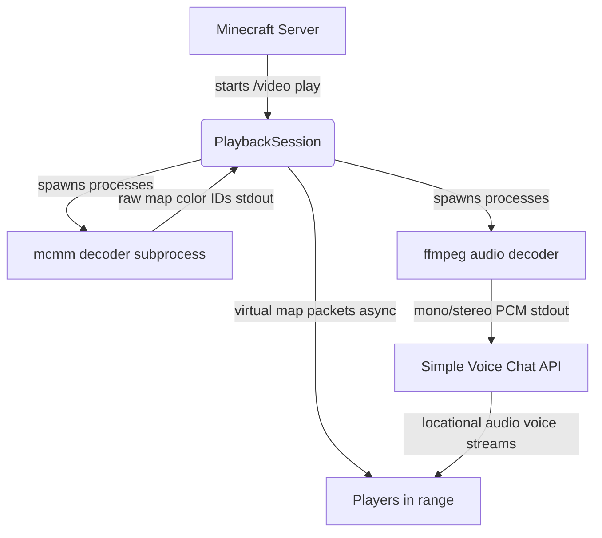

# 🚧 MinecraftVideo (VMC) Wiki & Documentation

Welcome to the full documentation for **MinecraftVideo (VMC)**. This wiki covers advanced commands, spatial audio configurations, subtitle track rendering, technical architecture, and custom compilation.

---

## 📖 Table of Contents

1. [Advanced Commands Reference](#-advanced-commands-reference)
2. [Options Configuration (`/video option`)](#%EF%B8%8F-options-configuration-video-option)
3. [Subtitle Tracking (`/video subs`)](#-subtitle-tracking-video-subs)
4. [Audio Modes & Spatialization](#-audio-modes--spatialization)
5. [Technical Architecture & Performance](#-technical-architecture--performance)
6. [Building & Compiling From Source](#-building--compiling-from-source)

---

## 💬 Advanced Commands Reference

All commands require the `minecraftvideo.use` permission (default: OP).

| Command | Description |
|---------|-------------|
| `/video play <url-or-path>` | Starts playback of the source. Uses configured default options. |
| `/video pause` | Freezes the video frame-loop and pauses the audio stream in sync. |
| `/video resume` | Continues playback from the paused state. |
| `/video stop` | Stops playback, completely removes the virtual screen, and clears the queue. |
| `/video seek <+s\|-s\|[hh:]mm:ss>` | Jumps relative (e.g., `+10`, `-30`) or absolute (e.g., `1:30`) in the video. |
| `/video skip` / `/video next` | Skips the current video and advances to the next queued item. |
| `/video status` | Displays decoding latency, effective FPS, and system headroom metrics. |

### Playlist & Queue Commands
- `/video queue add <url-or-path>`: Appends a media source to the queue. Starts playback immediately if idle.
- `/video queue list`: Lists all queued items with their order and short names.
- `/video queue remove <position>`: Removes the item at the specified position.
- `/video queue clear`: Clears all pending videos from the queue.

---

## ⚙️ Options Configuration (`/video option`)

The `/video option` command allows you to view or set configuration parameters on the fly, which are persisted to the server's `config.yml`.

### Screen Size & FPS
```
/video option <width> <height> [fps]
```
- **`<width>` and `<height>`**: Dimension in Minecraft maps (1 to 16). Each map is 128x128 pixels.
- **`[fps]`**: Frame rate limit (1 to 20 FPS). Default is 10.

### Audio Configuration
```
/video option audio <mono|stereo|surround>
```
Sets the spatial audio rendering mode. (See the [Audio Modes](#-audio-modes--spatialization) section below).

### A/V Synchronization
```
/video option avsync <milliseconds>
```
- **`<milliseconds>`**: Sync delay compensation (default: `200` ms). If audio is arriving late compared to the video, increase this value. If the audio is too early, decrease it.

### Subtitle Overlay Geometry
```
/video option sub <size|height|depth> <value>
```
Adjusts the 3D text overlay placement for subtitles:
- **`size <scale>`**: Text size scale (default: `1.0`, range: `0.1` to `20.0`).
- **`height <value>`**: Blocks relative to the bottom edge of the screen (default: `0.45`, range: `-20.0` to `20.0`).
- **`depth <value>`**: Distance in blocks in front of the screen (default: `0.05`, range: `-10.0` to `10.0`).

---

## 💬 Subtitle Tracking (`/video subs`)

VMC supports rendering text-based subtitles embedded inside your video files. Subtitles are displayed as a 3D text display entity located directly in front of the virtual screen.

1. **Check Available Tracks**:
   Run `/video subs list` to probe the media file using `ffprobe`. It will print all available embedded text subtitle tracks.
2. **Select and Load a Track**:
   Run `/video subs <track-number>` (e.g., `/video subs 0`) to load and display that subtitle track.
3. **Disable Subtitles**:
   Run `/video subs off` or `/video subs none` to turn them off.

*Note: Only text-based formats (like SRT, ASS, WebVTT) are supported. Bitmap subtitle tracks (such as PGS or DVD subtitles) cannot be rendered.*

---

## 🔊 Audio Modes & Spatialization

Minecraft does not support raw streaming audio channels by default. VMC achieves synced sound by streaming decoded mono PCM audio through **Simple Voice Chat**'s addon API. 

Depending on your configuration, VMC can spatialize the audio in three ways:

1. **Mono**: 
   The entire soundtrack is downmixed and anchored as a single locational source at the very center of the virtual screen.
2. **Stereo**: 
   Creates two separate virtual audio sources anchored at the left and right edges of the screen, mapping the left and right audio channels accordingly.
3. **Surround (5.1-like)**:
   Simulates a 6-speaker cinema system layout:
   - **Front Left / Center / Front Right**: Anchored at the screen plane.
   - **Subwoofer**: Placed at the base of the screen center.
   - **Rear Left / Rear Right**: Positioned behind the viewer/audience area.

---

## 🛠️ Technical Architecture & Performance

VMC is built for speed and low server overhead:



- **Subprocess Offloading**: The heavy decoding tasks of converting raw video to Minecraft map color palettes are handled by the external native binary `mcmm` and `ffmpeg` as subprocesses, keeping JVM garbage collection and CPU cycles clear.
- **Map Packet Virtualization**: No map item entities or world data are stored. Frames are sent directly to the client network queue using **PacketEvents** custom packet injection.
- **Asynchronous Broadcasting**: Packets are built and transmitted on a separate daemon thread to ensure the server's main tick loop is completely unaffected.
- **Dynamic Catch-up**: Late-joining players or players entering the tracking range are dynamically added to the packet broadcast list, instantly receiving the current screen state.

---

## 🔨 Building & Compiling From Source

If you want to compile VMC yourself or build for a platform other than Linux x64:

### 1. Compile the native converter (`mcmm`)
The native converter source code is located in `c version/`. Run the helper script to compile the binary and stage the map color palette:
```sh
./prepare-natives.sh
```
This script compiles a portable, statically-linked `mcmm` executable and copies it (along with `preset_color_list.json`) into `src/main/resources/`.

### 2. Package the Plugin Jar
Once the native binaries are staged in the resources directory, package the plugin using Maven:
```sh
mvn package
```
The compiled jar will be generated at `target/minecraftvideo-plugin-0.1.0.jar`.
